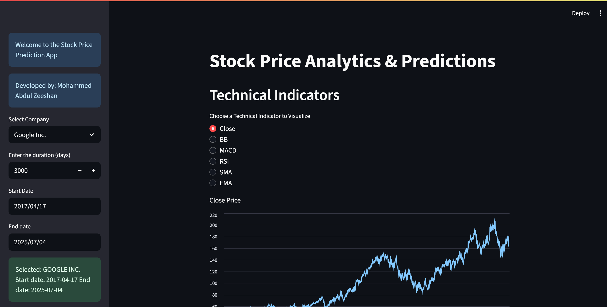
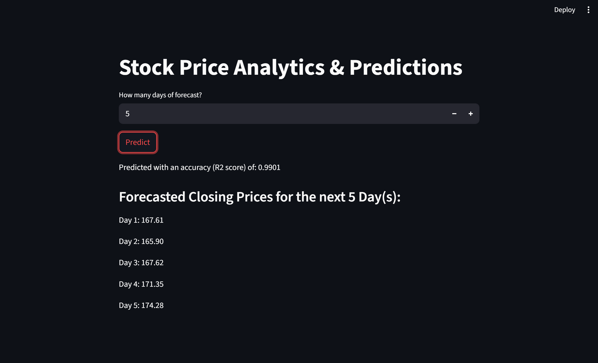
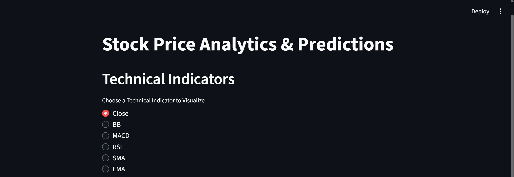
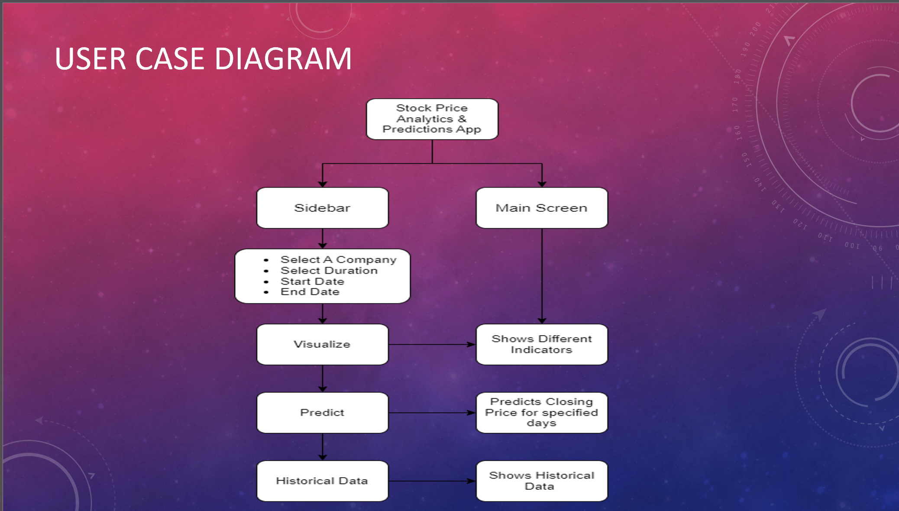
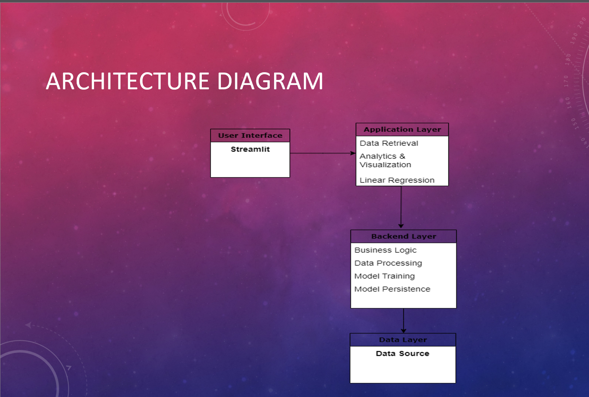
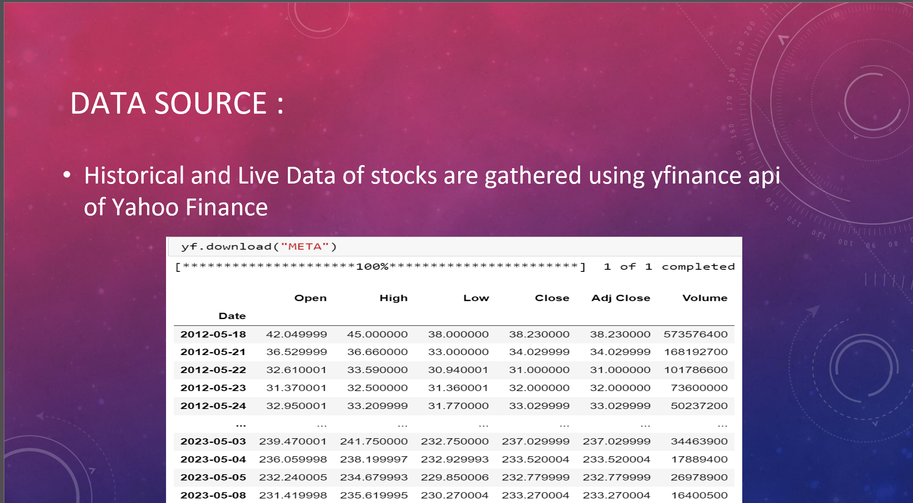

# Stock-Price-Prediction-Streamlit-App

## Overview
The stock market is one of the most dynamic and complex fields of finance, where the stock prices of companies continuously fluctuate. This project aims to develop a stock price prediction system using linear regression for top companies. The system is implemented as a web application using Streamlit, which provides an intuitive and interactive interface for users to analyze stock prices and make informed decisions. The project consists of two main components: stock price prediction and stock analysis using technical indicators. For stock price prediction, a linear regression model is trained using historical stock data, taking into account various factors such as company financials, market trends, and historical prices. The trained model is then deployed using Streamlit, allowing users to input relevant information and obtain predictions for future stock prices.

## Key Features
* **Visualize Historical Data:** Users can visualize historical stock price data using interactive charts, exploring trends and fluctuations over a specified time period.
* **Technical Indicator Analysis:** Incorporates various technical indicators, including Bollinger Bands, MACD, RSI, SMA, and EMA, to provide insights into stock price movement and market trends.
* **Recent Data Display:** Provides quick access to the most recent data of the selected stock, offering an up-to-date snapshot of its performance.
* **Stock Price Prediction:** Includes a prediction feature that utilizes linear regression for forecasting future stock prices based on historical data.
* **User-Friendly Interface:** Offers a clear navigation and intuitive controls, implemented with Streamlit, for a seamless user experience.
* **Customizable Stock Selection:** Allows users to select and analyze stocks from a predefined list of top companies (e.g., Google, Microsoft, Tesla, Airbnb, Meta).
* **Performance Evaluation Metrics:** Displays evaluation metrics such as R-squared score and Mean Absolute Error to assess the prediction model's accuracy and reliability.
* **Responsive Design:** Designed to be responsive, ensuring smooth user interactions and fast loading times across different devices.

## Screenshots
### Main Interface


### Prediction Output


### Technical Indicators


### User-Case Diagram


### Architecture Diagram


### Dataset Screenshot


## Technologies Used
* Python
* Streamlit (Web Application Framework)
* Pandas (Data Manipulation)
* yfinance (Stock Data Retrieval)
* ta (Technical Analysis Library)
* Scikit-learn (Machine Learning)

## How to Run Locally
1.  **Clone the repository:**
    ```bash
    git clone [https://github.com/zeeshan510/Stock-Price-Prediction-Streamlit-App.git](https://github.com/zeeshan510/Stock-Price-Prediction-Streamlit-App.git)
    cd Stock-Price-Prediction-Streamlit-App
    ```
2.  **Install dependencies:**
    ```bash
    pip install -r requirements.txt
    ```
    (You will create `requirements.txt` later, after you've put your `stock_app.py` in the repo.)
3.  **Run the Streamlit app:**
    ```bash
    streamlit run stock_app.py
    ```
    The application will open in your default web browser.

## Project Documentation
* [Full Project Report (PDF)](docs/Stock_Price_Prediction_Report.pdf)
* [Project Presentation (PDF)](docs/Stock_Price_Prediction_Presentation.pdf)

## Future Enhancements
The completion of this stock price prediction project opens up possibilities for future enhancements and expansions. Here are some potential avenues for further work:

* **Advanced Machine Learning Models:** Explore the application of more advanced machine learning models for stock price prediction, such as ensemble methods (Random Forest, Gradient Boosting), support vector machines (SVM), or deep learning architectures (Recurrent Neural Networks, Convolutional Neural Networks). Compare the performance of these models with the existing linear regression model to identify which approach yields better accuracy.
* **Feature Engineering:** Investigate additional features and indicators that can be incorporated into the prediction model. Consider fundamental data, news sentiment analysis, economic indicators, or social media sentiment to capture a wider range of factors influencing stock prices. Feature selection techniques and domain expertise can help identify the most relevant features for improving prediction accuracy.
* **Hyperparameter Tuning:** Perform extensive hyperparameter tuning for the machine learning models. Utilize techniques such as grid search, random search, or Bayesian optimization to find the optimal combination of hyperparameters that maximize prediction performance. Fine-tuning the models can lead to improved accuracy and generalization.
* **Ensemble Methods:** Explore ensemble techniques, such as model stacking or model averaging, to combine predictions from multiple models. Ensemble methods can often enhance the stability and robustness of predictions, particularly when dealing with volatile or noisy stock market data.
* **Deployment and Scalability:** Optimize the application for scalability to handle larger datasets and increasing user demands. Consider deploying the application on cloud platforms or containerized environments to ensure efficient resource utilization and accommodate a growing user base.
* **Real-time Data Integration:** Integrate real-time data feeds or APIs to provide users with up-to-date stock market information. This could include live streaming of stock prices, news updates, or social media sentiment analysis. Real-time data integration can enhance the application's value and keep users informed about market changes.
* **User Feedback and Iterative Improvement:** Gather feedback from users and incorporate their suggestions to enhance the application's usability and functionality. Conduct user testing sessions to identify pain points, understand user needs, and refine the user interface. Iteratively improve the application based on user feedback to ensure it meets the requirements and expectations of its target audience.
* **Expanded Data Analysis and Visualization:** Include additional data analysis and visualization features to provide users with deeper insights into stock market trends. This could involve more advanced charting techniques, interactive visualizations, correlation analysis, or sector-wise performance analysis. Expanding the range of analytical tools can empower users to make more informed investment decisions.
* **Risk Assessment and Portfolio Optimization:** Extend the application to include risk assessment and portfolio optimization functionalities. Implement algorithms and models to analyze risk levels, calculate portfolio returns, and suggest optimal investment allocations based on user preferences and risk tolerance.
* **Integration with Trading Platforms:** Integrate the application with popular trading platforms or brokerage APIs to provide users with a seamless trading experience. This could involve executing trades directly from the application, tracking portfolio performance, or receiving real-time trading alerts based on prediction models.

## Developed By
* Mohammed Abdul Zeeshan

## License
This project is licensed under the MIT License - see the [LICENSE](LICENSE] file for details.
